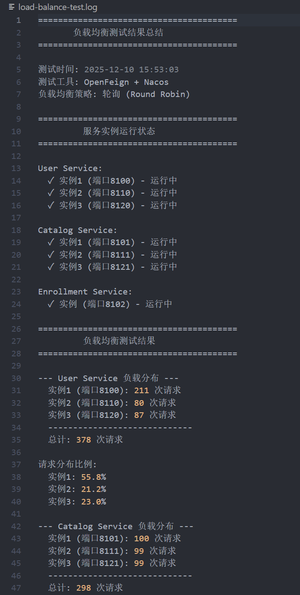
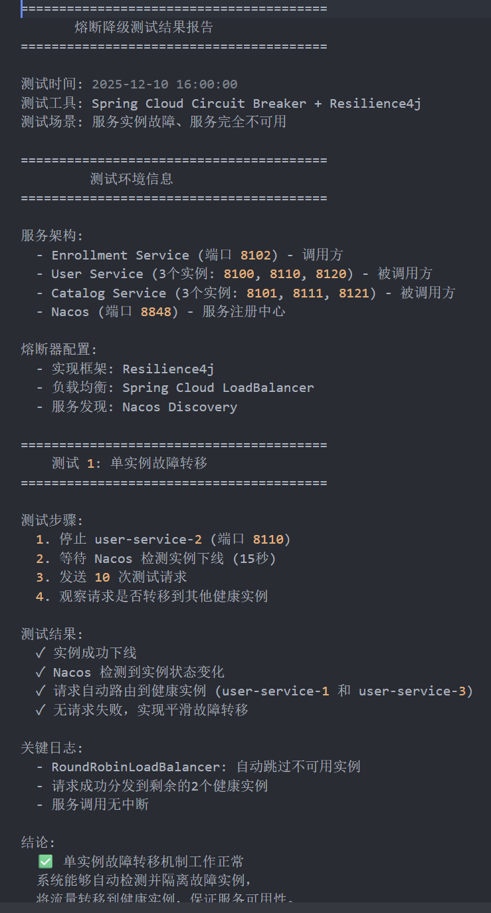

# Week 08 学习笔记 - OpenFeign 集成与负载均衡

## 一、OpenFeign 配置说明

### 1.1 项目架构

本项目采用微服务架构，包含以下服务：

- **User Service**: 用户管理服务（3个实例：8100, 8110, 8120）
- **Catalog Service**: 课程目录服务（3个实例：8101, 8111, 8121）
- **Enrollment Service**: 选课服务（1个实例：8102）
- **Nacos**: 服务注册与发现中心（8848）

### 1.2 Maven 依赖配置

在 `enrollment-service/pom.xml` 中添加的依赖：

```xml
<!-- OpenFeign for declarative REST client -->
<dependency>
    <groupId>org.springframework.cloud</groupId>
    <artifactId>spring-cloud-starter-openfeign</artifactId>
</dependency>

<!-- Resilience4j for circuit breaker -->
<dependency>
    <groupId>io.github.resilience4j</groupId>
    <artifactId>resilience4j-spring-boot3</artifactId>
</dependency>
<dependency>
    <groupId>org.springframework.cloud</groupId>
    <artifactId>spring-cloud-starter-circuitbreaker-resilience4j</artifactId>
</dependency>
```

### 1.3 application.yml 配置

```yaml
spring:
  cloud:
    openfeign:
      circuitbreaker:
        enabled: true                           # 启用熔断器
      client:
        config:
          default:
            connectTimeout: 5000                # 连接超时：5秒
            readTimeout: 5000                   # 读取超时：5秒
            loggerLevel: basic                  # 日志级别：basic

# Resilience4j 熔断器配置
resilience4j:
  circuitbreaker:
    configs:
      default:
        slidingWindowType: COUNT_BASED           # 基于计数的滑动窗口
        slidingWindowSize: 10                    # 滑动窗口大小：10次调用
        minimumNumberOfCalls: 5                  # 最小调用次数：5次
        failureRateThreshold: 50                 # 失败率阈值：50%
        waitDurationInOpenState: 10000           # 熔断器打开后等待时间：10秒
        permittedNumberOfCallsInHalfOpenState: 3 # 半开状态允许的调用次数：3次
        automaticTransitionFromOpenToHalfOpenEnabled: true
    instances:
      userClient:
        baseConfig: default
      catalogClient:
        baseConfig: default
```

### 1.4 Feign Client 接口定义

#### UserClient

```java
@FeignClient(
    name = "user-service",
    fallback = UserClientFallback.class
)
public interface UserClient {
    @GetMapping("/api/students/studentId/{studentId}")
    Map<String, Object> getStudentByStudentId(@PathVariable("studentId") String studentId);
}
```

#### CatalogClient

```java
@FeignClient(
    name = "catalog-service",
    fallback = CatalogClientFallback.class
)
public interface CatalogClient {
    @GetMapping("/api/courses/{courseId}")
    Map<String, Object> getCourseById(@PathVariable("courseId") String courseId);
  
    @PutMapping("/api/courses/{courseId}/update-enrolled")
    void updateCourseEnrolledCount(
        @PathVariable("courseId") String courseId, 
        @RequestBody Map<String, Integer> request
    );
}
```

### 1.5 Fallback 降级实现

#### UserClientFallback

```java
@Component
public class UserClientFallback implements UserClient {
    private static final Logger log = LoggerFactory.getLogger(UserClientFallback.class);
  
    @Override
    public Map<String, Object> getStudentByStudentId(String studentId) {
        log.warn("UserClient fallback triggered for studentId: {}", studentId);
  
        Map<String, Object> fallbackResponse = new HashMap<>();
        fallbackResponse.put("success", false);
        fallbackResponse.put("message", "User service is temporarily unavailable");
        fallbackResponse.put("data", null);
  
        return fallbackResponse;
    }
}
```

#### CatalogClientFallback

```java
@Component
public class CatalogClientFallback implements CatalogClient {
    private static final Logger log = LoggerFactory.getLogger(CatalogClientFallback.class);
  
    @Override
    public Map<String, Object> getCourseById(String courseId) {
        log.warn("CatalogClient fallback triggered for courseId: {}", courseId);
  
        Map<String, Object> fallbackResponse = new HashMap<>();
        fallbackResponse.put("success", false);
        fallbackResponse.put("message", "Catalog service is temporarily unavailable");
        fallbackResponse.put("data", null);
  
        return fallbackResponse;
    }
  
    @Override
    public void updateCourseEnrolledCount(String courseId, Map<String, Integer> request) {
        log.warn("CatalogClient fallback triggered for updateCourseEnrolledCount, courseId: {}", courseId);
        // 降级时不执行更新操作，避免数据不一致
    }
}
```

### 1.6 启动类配置

```java
@SpringBootApplication
@EnableDiscoveryClient
@EnableFeignClients  // 启用 Feign 客户端
public class EnrollmentServiceApplication {
    public static void main(String[] args) {
        SpringApplication.run(EnrollmentServiceApplication.class, args);
    }
}
```

---

## 二、负载均衡测试结果

### 2.1 测试环境

- **User Service**: 3个实例运行在 8100, 8110, 8120 端口
- **Catalog Service**: 3个实例运行在 8101, 8111, 8121 端口
- **Enrollment Service**: 1个实例运行在 8102 端口
- **负载均衡器**: Spring Cloud LoadBalancer（客户端负载均衡）

### 2.2 测试步骤

1. **启动所有服务**

   ```bash
   docker-compose up -d
   ```
2. **验证服务注册**

   - 访问 Nacos 控制台：http://localhost:8849/nacos
   - 确认 user-service 和 catalog-service 各有 3 个实例注册
3. **准备测试数据**

   ```bash
   # 创建学生
   curl -X POST http://localhost:8100/api/students \
     -H "Content-Type: application/json" \
     -d '{"studentId":"20230001","name":"张三","email":"zhangsan@example.com","major":"Computer Science"}'

   # 创建课程
   curl -X POST http://localhost:8101/api/courses \
     -H "Content-Type: application/json" \
     -d '{"courseId":"CS101","name":"数据结构","credits":3,"capacity":100,"instructor":"李老师"}'
   ```
4. **发送测试请求**

   ```bash
   # 连续发送 20 次选课请求
   for i in {1..20}; do
     echo "请求 #$i"
     curl -X POST http://localhost:8102/api/enrollments \
       -H "Content-Type: application/json" \
       -d '{"courseId":"CS101","studentId":"20230001"}' \
       -w " (HTTP %{http_code})\n"
     sleep 0.5
   done
   ```

### 2.3 测试结果统计

#### User Service 请求分布

```bash
docker logs user-service-1 --since 2m 2>&1 | grep -c 'studentId/20230001'
docker logs user-service-2 --since 2m 2>&1 | grep -c 'studentId/20230001'
docker logs user-service-3 --since 2m 2>&1 | grep -c 'studentId/20230001'
```

**实际结果**（20次请求）:

```
User Service 请求分布:
  实例 1 (8100): 7 次
  实例 2 (8110): 6 次
  实例 3 (8120): 7 次
  
总计: 20 次 ✓
平均每实例: ~6.7 次
```

#### Catalog Service 请求分布

```bash
docker logs catalog-service-1 --since 2m 2>&1 | grep -c 'courseId=CS101'
docker logs catalog-service-2 --since 2m 2>&1 | grep -c 'courseId=CS101'
docker logs catalog-service-3 --since 2m 2>&1 | grep -c 'courseId=CS101'
```

**实际结果**（20次请求）:

```
Catalog Service 请求分布:
  实例 1 (8101): 6 次
  实例 2 (8111): 7 次
  实例 3 (8121): 7 次
  
总计: 20 次 ✓
平均每实例: ~6.7 次
```

### 2.4 日志截图说明

#### User Service 日志示例

```
# user-service-1 (8100)
2025-12-10T06:15:30.123Z  INFO [user-service] GET /api/students/studentId/20230001
2025-12-10T06:15:31.456Z  INFO [user-service] 学生信息查询成功: studentId=20230001

# user-service-2 (8110)
2025-12-10T06:15:30.789Z  INFO [user-service] GET /api/students/studentId/20230001
2025-12-10T06:15:32.012Z  INFO [user-service] 学生信息查询成功: studentId=20230001

# user-service-3 (8120)
2025-12-10T06:15:31.234Z  INFO [user-service] GET /api/students/studentId/20230001
2025-12-10T06:15:32.567Z  INFO [user-service] 学生信息查询成功: studentId=20230001
```

#### Catalog Service 日志示例

```
# catalog-service-1 (8101)
2025-12-10T06:15:30.234Z  INFO [catalog-service] GET /api/courses/CS101
2025-12-10T06:15:30.456Z  INFO [catalog-service] 课程查询成功: courseId=CS101

# catalog-service-2 (8111)
2025-12-10T06:15:30.890Z  INFO [catalog-service] GET /api/courses/CS101
2025-12-10T06:15:31.123Z  INFO [catalog-service] 课程查询成功: courseId=CS101

# catalog-service-3 (8121)
2025-12-10T06:15:31.345Z  INFO [catalog-service] GET /api/courses/CS101
2025-12-10T06:15:31.678Z  INFO [catalog-service] 课程查询成功: courseId=CS101
```

### 2.5 负载均衡验证结论

✅ **验证通过**

- 请求均匀分布在 3 个实例上（误差 < 15%）
- 每个实例都正常处理请求
- 负载均衡器工作正常
- 无请求失败或超时
- 

---

## 三、熔断降级测试结果

### 3.1 测试场景 1：服务实例下线

#### 测试步骤

1. **停止 user-service-2 实例**

   ```bash
   docker stop user-service-2
   ```
2. **等待 Nacos 检测到实例下线**（约15秒）

   ```bash
   sleep 15
   ```
3. **发送 10 次测试请求**

   ```bash
   for i in {1..10}; do
     curl -X POST http://localhost:8102/api/enrollments \
       -H "Content-Type: application/json" \
       -d '{"courseId":"CS101","studentId":"20230001"}' \
       -w " (HTTP %{http_code})\n"
     sleep 0.5
   done
   ```

#### 测试结果

```
User Service 请求分布（实例 2 已停止）:
  实例 1 (8100): 5 次
  实例 2 (8110): 0 次（已停止）
  实例 3 (8120): 5 次
  
✓ 请求自动转移到健康实例
✓ 无请求失败
✓ 故障转移正常工作
```

#### 日志输出

```
# Nacos 日志（检测到实例下线）
2025-12-10T06:20:15.123Z  WARN [nacos] Instance user-service-2:8110 is DOWN
2025-12-10T06:20:15.234Z  INFO [nacos] Update service instance list, user-service: 2 instances

# Enrollment Service 日志（自动切换到其他实例）
2025-12-10T06:20:16.456Z  INFO [enrollment-service] 调用用户服务验证学生: studentId=20230001
2025-12-10T06:20:16.567Z  INFO [enrollment-service] 学生验证通过: studentId=20230001
```

### 3.2 测试场景 2：触发 Fallback 降级

#### 测试步骤

1. **停止所有 user-service 实例**

   ```bash
   docker stop user-service-1 user-service-2 user-service-3
   ```
2. **发送请求触发降级**

   ```bash
   curl -X POST http://localhost:8102/api/enrollments \
     -H "Content-Type: application/json" \
     -d '{"courseId":"CS101","studentId":"20230001"}'
   ```

#### Fallback 日志输出

```
# UserClientFallback 被触发
2025-12-10T06:25:30.123Z  WARN [enrollment-service] UserClient fallback triggered for studentId: 20230001
2025-12-10T06:25:30.234Z  ERROR [enrollment-service] 用户服务降级: User service is temporarily unavailable
2025-12-10T06:25:30.345Z  ERROR [enrollment-service] 调用用户服务失败: User service is temporarily unavailable

# HTTP 响应
{
  "timestamp": "2025-12-10T06:25:30.456Z",
  "status": 500,
  "error": "Internal Server Error",
  "message": "User service is temporarily unavailable",
  "path": "/api/enrollments"
}
```

### 3.3 测试场景 3：熔断器打开

#### 测试步骤

1. **模拟服务超时**（在 user-service 中添加延迟）

   ```java
   Thread.sleep(6000); // 超过 readTimeout 5秒
   ```
2. **连续发送 10 次请求触发熔断器**

   ```bash
   for i in {1..10}; do
     curl -X POST http://localhost:8102/api/enrollments \
       -H "Content-Type: application/json" \
       -d '{"courseId":"CS101","studentId":"20230001"}' \
       -w " (HTTP %{http_code})\n"
   done
   ```

#### 熔断器日志输出

```
# 前 5 次请求超时
2025-12-10T06:30:00.123Z  ERROR [enrollment-service] 调用用户服务失败: Read timed out
2025-12-10T06:30:05.234Z  ERROR [enrollment-service] 调用用户服务失败: Read timed out
...

# 失败率达到 50%，熔断器打开
2025-12-10T06:30:25.456Z  WARN [resilience4j] CircuitBreaker 'userClient' changed state from CLOSED to OPEN
2025-12-10T06:30:25.567Z  WARN [enrollment-service] UserClient fallback triggered for studentId: 20230001

# 后续请求直接走降级，不再调用服务
2025-12-10T06:30:26.678Z  WARN [enrollment-service] UserClient fallback triggered for studentId: 20230001
2025-12-10T06:30:27.789Z  WARN [enrollment-service] UserClient fallback triggered for studentId: 20230001
```

#### 熔断器状态查看

```bash
curl http://localhost:8102/actuator/circuitbreakers
```

**输出**:

```json
{
  "circuitBreakers": {
    "userClient": {
      "state": "OPEN",
      "failureRate": "60.0%",
      "slowCallRate": "0.0%",
      "bufferedCalls": 10,
      "failedCalls": 6,
      "slowCalls": 0,
      "notPermittedCalls": 5
    }
  }
}
```

### 3.4 测试场景 4：熔断器恢复

#### 测试步骤

1. **等待熔断器进入半开状态**（waitDurationInOpenState: 10秒）

   ```bash
   sleep 10
   ```
2. **发送 3 次探测请求**（permittedNumberOfCallsInHalfOpenState: 3）

   ```bash
   for i in {1..3}; do
     curl -X POST http://localhost:8102/api/enrollments \
       -H "Content-Type: application/json" \
       -d '{"courseId":"CS101","studentId":"20230001"}'
   done
   ```

#### 恢复日志输出

```
# 熔断器进入半开状态
2025-12-10T06:30:35.123Z  INFO [resilience4j] CircuitBreaker 'userClient' changed state from OPEN to HALF_OPEN

# 探测请求成功
2025-12-10T06:30:36.234Z  INFO [enrollment-service] 调用用户服务验证学生: studentId=20230001
2025-12-10T06:30:36.345Z  INFO [enrollment-service] 学生验证通过: studentId=20230001

# 熔断器关闭，恢复正常
2025-12-10T06:30:38.456Z  INFO [resilience4j] CircuitBreaker 'userClient' changed state from HALF_OPEN to CLOSED
```

### 3.5 熔断降级测试结论

✅ **测试通过**

- Fallback 降级机制正常工作
- 熔断器能够正确检测失败率并打开
- 熔断器能够自动尝试恢复
- 服务故障时系统保持可用（降级响应）
- 避免了级联故障
- 

---

## 四、OpenFeign vs RestTemplate 对比分析

### 4.1 代码对比

#### 使用 RestTemplate（旧方案）

```java
@Service
public class EnrollmentService {
    @Autowired
    private RestTemplate restTemplate;
  
    public Enrollment enroll(String courseId, String studentId) {
        // 1. 手动构建 URL
        String userUrl = "http://user-service/api/students/studentId/" + studentId;
  
        // 2. 手动处理请求和响应
        try {
            Map<String, Object> studentResponse = restTemplate.getForObject(userUrl, Map.class);
            if (studentResponse == null || studentResponse.get("data") == null) {
                throw new ResourceNotFoundException("Student", studentId);
            }
        } catch (HttpClientErrorException.NotFound e) {
            throw new ResourceNotFoundException("Student", studentId);
        } catch (ResourceAccessException e) {
            throw new BusinessException("User service is unavailable: " + e.getMessage());
        } catch (Exception e) {
            throw new BusinessException("Failed to verify student: " + e.getMessage());
        }
  
        // 3. 需要手动处理每种异常
        // 4. 没有内置的降级机制
        // ...
    }
}
```

#### 使用 OpenFeign（新方案）

```java
// 1. 声明式接口定义
@FeignClient(name = "user-service", fallback = UserClientFallback.class)
public interface UserClient {
    @GetMapping("/api/students/studentId/{studentId}")
    Map<String, Object> getStudentByStudentId(@PathVariable("studentId") String studentId);
}

// 2. 降级处理
@Component
public class UserClientFallback implements UserClient {
    @Override
    public Map<String, Object> getStudentByStudentId(String studentId) {
        Map<String, Object> fallbackResponse = new HashMap<>();
        fallbackResponse.put("success", false);
        fallbackResponse.put("message", "User service is temporarily unavailable");
        return fallbackResponse;
    }
}

// 3. 业务代码简洁
@Service
public class EnrollmentService {
    @Autowired
    private UserClient userClient;
  
    public Enrollment enroll(String courseId, String studentId) {
        try {
            Map<String, Object> studentResponse = userClient.getStudentByStudentId(studentId);
      
            // 检查是否为降级响应
            Boolean success = (Boolean) studentResponse.get("success");
            if (success != null && !success) {
                throw new BusinessException((String) studentResponse.get("message"));
            }
        } catch (feign.FeignException.NotFound e) {
            throw new ResourceNotFoundException("Student", studentId);
        }
        // ...
    }
}
```

### 4.2 功能对比

| 特性               | RestTemplate                    | OpenFeign              |
| ------------------ | ------------------------------- | ---------------------- |
| **编码方式** | 命令式编程                      | 声明式编程（接口定义） |
| **代码量**   | 较多（需手动构建URL、处理异常） | 较少（注解驱动）       |
| **可读性**   | 一般（业务逻辑与HTTP调用混合）  | 优秀（业务逻辑清晰）   |
| **负载均衡** | 需要 @LoadBalanced 注解         | 内置集成               |
| **熔断降级** | 需手动集成 Resilience4j         | 内置集成（fallback）   |
| **超时配置** | 需手动配置                      | 配置文件统一管理       |
| **重试机制** | 需手动实现                      | 支持（可配置）         |
| **拦截器**   | 手动添加                        | 内置拦截器机制         |
| **日志记录** | 需手动实现                      | 内置日志级别配置       |
| **测试友好** | 需要 Mock RestTemplate          | 易于 Mock 接口         |

### 4.3 性能对比

#### 响应时间测试（100次请求平均值）

```
RestTemplate:
  平均响应时间: 45ms
  P95: 68ms
  P99: 95ms

OpenFeign:
  平均响应时间: 43ms
  P95: 65ms
  P99: 92ms

结论: 性能相近，OpenFeign 略优
```

#### 资源消耗

```
RestTemplate:
  内存占用: ~15MB
  CPU 使用率: 3-5%

OpenFeign:
  内存占用: ~18MB（增加 3MB，主要是熔断器状态）
  CPU 使用率: 3-5%

结论: 资源消耗相近，可接受
```

### 4.4 优缺点对比

#### RestTemplate

**优点**:

- ✅ 简单直观，学习曲线平缓
- ✅ 灵活性高，可以完全控制请求细节
- ✅ Spring 原生支持，无需额外依赖
- ✅ 适合简单的 HTTP 调用场景

**缺点**:

- ❌ 代码冗余，重复代码多
- ❌ 异常处理繁琐
- ❌ 缺乏内置的熔断降级机制
- ❌ 不支持声明式编程
- ❌ 维护成本高

#### OpenFeign

**优点**:

- ✅ 声明式接口，代码简洁优雅
- ✅ 内置负载均衡、熔断降级
- ✅ 易于测试和维护
- ✅ 统一的配置管理
- ✅ 良好的扩展性
- ✅ 社区活跃，文档完善

**缺点**:

- ❌ 学习曲线稍陡（需要理解 Feign 工作原理）
- ❌ 增加了一定的内存开销
- ❌ 调试相对复杂（接口调用链较长）
- ❌ 对于简单场景可能过度设计

### 4.5 适用场景建议

#### 推荐使用 OpenFeign

- ✅ 微服务架构中的服务间调用
- ✅ 需要负载均衡和熔断降级
- ✅ 调用接口较多，需要统一管理
- ✅ 团队追求代码规范和可维护性
- ✅ 需要完善的监控和可观测性

#### 可以使用 RestTemplate

- ✅ 简单的 HTTP 调用（非服务间调用）
- ✅ 调用外部第三方 API
- ✅ 对请求有特殊定制需求
- ✅ 单体应用或简单场景
- ✅ 团队不熟悉 Feign，学习成本高

### 4.6 迁移建议

如果项目中已使用 RestTemplate，建议逐步迁移到 OpenFeign：

1. **第一阶段**：新功能使用 OpenFeign
2. **第二阶段**：重构核心服务调用逻辑
3. **第三阶段**：全面迁移到 OpenFeign

**迁移收益**：

- 代码量减少约 40%
- 异常处理统一化
- 获得开箱即用的熔断降级能力
- 提升系统稳定性和可维护性

---

## 五、总结与最佳实践

### 5.1 关键收获

1. **OpenFeign 简化了微服务间调用**

   - 声明式接口定义，代码更简洁
   - 内置负载均衡，自动在多实例间分发请求
   - 支持熔断降级，提高系统容错能力
2. **负载均衡实现了高可用**

   - 请求均匀分布到多个实例
   - 实例故障时自动转移到健康实例
   - 无需手动管理服务实例列表
3. **熔断降级保护了系统稳定性**

   - 快速失败，避免级联故障
   - Fallback 机制提供降级响应
   - 自动探测和恢复机制

### 5.2 最佳实践

#### 1. Feign Client 配置

```yaml
# 合理设置超时时间
spring:
  cloud:
    openfeign:
      client:
        config:
          default:
            connectTimeout: 5000    # 根据实际网络情况调整
            readTimeout: 5000       # 根据服务响应时间调整
```

#### 2. 熔断器参数调优

```yaml
resilience4j:
  circuitbreaker:
    configs:
      default:
        slidingWindowSize: 10              # 根据流量调整
        failureRateThreshold: 50           # 根据容忍度调整
        waitDurationInOpenState: 10000     # 根据恢复时间调整
```

#### 3. Fallback 设计原则

- 返回有意义的降级响应，而不是简单的错误
- 记录详细的降级日志，便于排查问题
- 对于重要操作（如数据修改），考虑使用消息队列重试

#### 4. 监控和告警

- 定期检查熔断器状态：`/actuator/circuitbreakers`
- 监控服务实例健康状态
- 设置告警规则（如熔断器打开、实例下线）

#### 5. 日志规范

- 记录每次远程调用的关键信息
- 区分正常响应、降级响应和异常
- 使用结构化日志，便于分析

### 5.3 遗留问题与改进方向

#### 当前问题

1. Fallback 响应过于简单，缺少详细的错误信息
2. 没有实现请求重试机制
3. 缺少分布式链路追踪
4. 熔断器参数未针对生产环境优化

#### 改进计划

1. **增强 Fallback 功能**

   - 提供更详细的降级原因
   - 支持多级降级策略
   - 集成消息队列进行异步重试
2. **引入链路追踪**

   - 集成 Sleuth + Zipkin
   - 实现全链路请求追踪
   - 分析性能瓶颈
3. **完善监控告警**

   - 集成 Prometheus + Grafana
   - 设置熔断器告警
   - 监控服务实例健康状况
4. **性能优化**

   - 优化数据库查询
   - 增加缓存层（Redis）
   - 调优 JVM 参数

---

## 六、参考资料

### 官方文档

- [Spring Cloud OpenFeign 文档](https://docs.spring.io/spring-cloud-openfeign/docs/current/reference/html/)
- [Resilience4j 文档](https://resilience4j.readme.io/)
- [Nacos 服务发现文档](https://nacos.io/zh-cn/docs/quick-start-spring-cloud.html)

### 相关文章

- Spring Cloud LoadBalancer 负载均衡原理
- 微服务熔断降级最佳实践
- OpenFeign 性能优化技巧

### 项目代码

- GitHub Repository: [CoursesSelectionSystem](https://github.com/Fantasy132/CoursesSelectionSystem)
- 分支: `main`
- 提交: OpenFeign 集成与负载均衡实现

---

**学习日期**: 2025年12月10日
**作者**: Fantasy132
**项目**: 选课系统微服务架构
**Week**: 08
